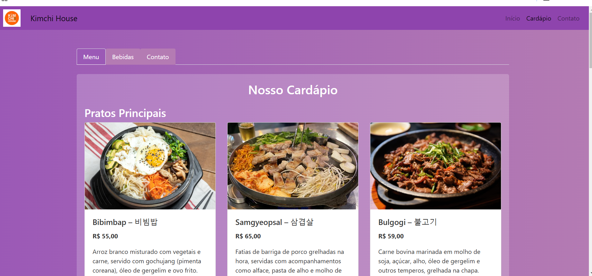
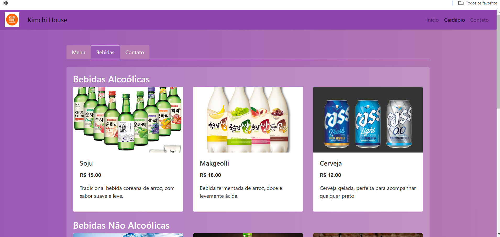
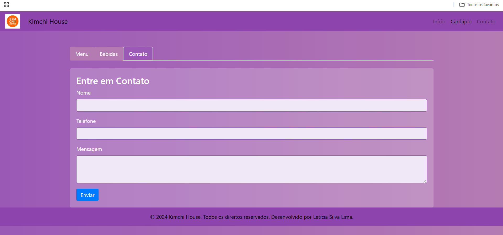

### CARDAPIO ONLINE

### Descrição
O objetivo deste projeto é criar um sistema simples para apresentar um cardápio digital em um site, permitindo que o usuário visualize uma lista de itens de forma interativa e organizada. O projeto utiliza as tecnologias PHP para gerar dinamicamente as informações do cardápio, HTML para a estrutura do conteúdo e CSS para o estilo visual da página.

O sistema pode ser facilmente adaptado para diferentes tipos de cardápios, sendo uma excelente solução para restaurantes, lanchonetes e outros estabelecimentos comerciais.

### Funcionalidades
Exibição de Cardápio: Os itens do cardápio são listados de forma clara, com nome, descrição e preço.
Estrutura Simples e Responsiva: O layout se adapta a diferentes tamanhos de tela, garantindo uma boa experiência tanto em dispositivos móveis quanto desktops.
Fácil Personalização: Basta editar os arquivos PHP e HTML para adicionar, remover ou modificar itens do cardápio conforme necessário.
### Tecnologias Utilizadas
PHP: Linguagem de programação server-side para manipulação dinâmica dos dados.
HTML: Estruturação do conteúdo web.
CSS: Estilização para tornar a página visualmente atrativa e responsiva.
XAMPP: Servidor local para rodar o PHP e fornecer suporte a banco de dados (se necessário).
### Como Executar o Projeto
Instalar o XAMPP: Caso ainda não tenha, baixe e instale o XAMPP para rodar o servidor local.
Iniciar o Apache: Abra o painel de controle do XAMPP e inicie o servidor Apache.
Colocar os Arquivos na Pasta "htdocs": Coloque os arquivos do projeto dentro da pasta htdocs do XAMPP.
Acessar no Navegador: Abra o navegador e acesse http://localhost/nomedapasta, substituindo nomedapasta pelo nome da pasta onde os arquivos estão localizados.
### Como Contribuir
Fique à vontade para fazer contribuições! Se você deseja adicionar novas funcionalidades ou corrigir algum erro, basta criar um pull request ou abrir uma issue para discussão.

### Licença
Este projeto está licenciado sob a Licença MIT.

### Contato
(11)954339681
e-mail: lslima1320@gmail.com

